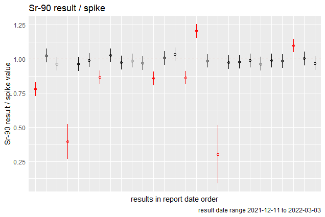

<!-- README.md is generated from README.Rmd. Please edit that file -->

# blindspiker

The R package, `blindspiker`, was initially developed for the Internal
Dosimetry program at the Savannah River Site, based on an R script, “SRS
Blind Spikes-4.R”, written by Tom Labone.

The first step in using the package is to **load your data.** This is
made easy **with the `get_data` ** function. This function reads in data
directly from .csv files. See the help for `get_data` (`?get_data`) for
the necessary columns.

To summarize the spike values provided to the laboratory,

**`table_spike` summarizes all individual spike values** and

**`spike_combos` provides any combinations** of spike values in
individual samples that the user chooses to have tallied.

**`plot_run` provides run charts** with the option of plotting in
analysis units or by a ratio of the laboratory results to the blind
spike values. Both versions show uncertainty ranges of the results.
Uncertainty bars are shown on the laboratory results and the ratios.
When there is no overlap with the spike values, the laboratory result is
either a false positive or a false negative. False positives are
excluded from the ratio version when there is no spike value to avoid
division by zero.

**`table_false` provides confidence intervals on error rates** for all
laboratory results.

**`plot_tat` plots the laboratory turnaround time** for each spike
sample.

**`plot_qq` provides quantile-quantile plots** of the results. Random
errors are expected to fluctuate in a normally distributed pattern. When
the QQ plot shows a deviation from normal, further investigation in the
underlying process may be needed.
